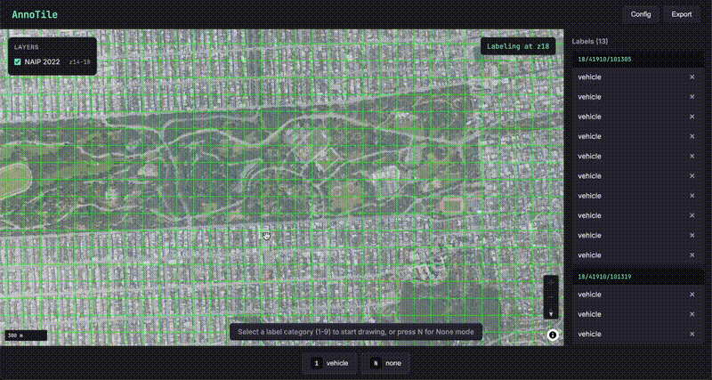

# AnnoTile: Label large-scale geospatial datasets with tile servers

AnnoTile is a tool to label bounding boxes for geospatial datasets. It decoules labeling from data storage. You can label any dataset that can be served by an XYZ tile server.

You can draw bounding boxes on mercantile tiles and export labels as GeoJSON, GeoParquet, or COCO JSON annotation format. You can also download the underlying tile images for ML training and inference. This is built with React + FastAPI + MapLibre. Exported data is compatible with standard computer vision tools and ML tools like `pytorch` and `ultralytics`.

## Features

- Configure multiple tile server URLs with custom bounds, zoom levels, and tile sizes
- Draw bounding boxes within tiles
- Hotkey-driven label assignment for custom categories or negative examples
- Persist labels to GeoParquet, GeoJSON, or COCO JSON for ML training
- Download tiles over bounding boxes to build training datasets

## Prerequisites

- Python 3.12+ with [uv](https://github.com/astral-sh/uv)
- Node.js 20+



## Setup

### Backend

```bash
cd backend
uv sync
uv run uvicorn main:app --reload --port 8000
```

### Frontend

```bash
cd frontend
npm install
npm run dev
```

The frontend runs at http://localhost:5173 and the backend API at http://localhost:8000.

### Tile Server Backends

If you need to stand up tile servers, there are a few options available:

#### Open Source

- [TiTiler](https://developmentseed.org/titiler/): Lightweight XYZ dynamic tiling for Cloud Optimized GeoTIFFs and other raster sources.
- [GeoServer](https://geoserver.org/): Supports serving vector and raster data using standard web protocols (WMS, WMTS, WFS, XYZ, etc).
- [xpublish](https://github.com/xpublish-community/xpublish): Built on Xarray for serving scientific (multi-dimensional) datasets. Useful for tiled access to netCDF or Zarr.

#### Proprietary

- [Earthscale](https://earthscale.ai/): The company behind AnnoTile, serve from cloud raster mosaics (COGs, Zarr, STAC).
- [Mapbox](https://www.mapbox.com/maps/): Raster tile hosting, global mapping API with commercial plans.
- [Esri](https://www.esri.com/): Offers a variety of servers and tile services for ArcGIS ecosystem users.
- [Google Earth Engine](https://earthengine.google.com/): you can use `ee.Image.getMap()` to get a temporary tile server URL for any given EE image.

## Usage

### 1. Configure Tile Servers

Click **Config** to add tile servers. Each server needs:

- **Name**: Display name
- **URL template**: Tile URL with `{z}/{x}/{y}` placeholders
- **Tile size**: 512 (default) or 256 for OSM

Example URL: `https://tile.server.com/tiles/{z}/{x}/{y}.png`

### 2. Set Labeling Parameters

In the Config panel:

- Set the **labeling zoom level** (tiles will be shown at this zoom)
- Set the **labeling extent** (optional, for download scope)
- Add/remove **label categories** (accessible via hotkeys 1-9)

### 3. Enable Layers

Use the **Layers** panel (top-left on map) to toggle tile server visibility.

### 4. Draw Bounding Boxes

1. Click and drag on the map to draw a bounding box
2. Press a number key (1-9) to assign a label category
3. Press **N** to mark the tile as having no objects (negative example)
4. Press **Esc** to cancel

### 5. Manage Labels

The sidebar shows all labels grouped by tile. Click to select, click × to delete.

Hotkeys:

- **1-9**: Assign label (after drawing bbox)
- **N**: Mark tile as negative
- **D**: Delete selected label
- **Esc**: Cancel drawing

### 6. Export

Click **Export** to:

- **Export GeoJSON**: Download labels with geographic bboxes and tile indices
- **Export COCO JSON**: Download in COCO format for ML training
- **Download Labeled Tiles**: Download tile images for labeled tiles only
- **Download All Tiles**: Download all tiles in the labeling extent

## Data Storage

- `data/config.json` - Tile server configuration
- `data/ui_state.json` - UI state (viewport, active layers)
- `data/labels.geoparquet` - Labels/annotations
- `data/tiles/` - Downloaded tile images
